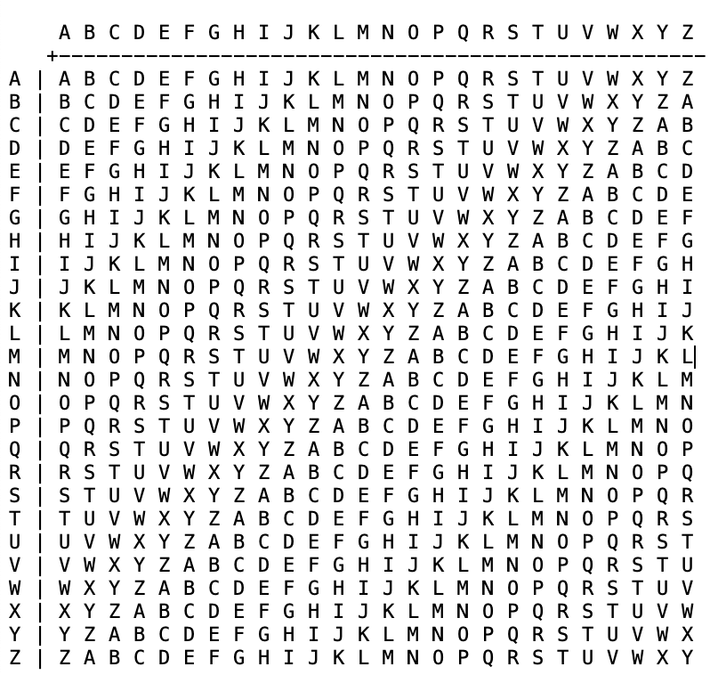

## Easy1
### Category
Cryptography
### Problem
The one time pad can be cryptographically secure, but not when you know the key. Can you solve this? We've given you the encrypted flag, key, and a table to help UFJKXQZQUNB with the key of SOLVECRYPTO. Can you use this [table](./misc_files/table.txt) to solve it?.
### Hints
1) Submit your answer in our flag format. For example, if your answer was 'hello', you would submit 'picoCTF{HELLO}' as the flag.

2) Please use all caps for the message.
### Solution

**STEP 1**

Let's start by looking at the table:



**STEP 2**

This is a Vignere (pronounced something like "vin-yey") cipher, and we know the key (SOLVECRYPTO), so we can decipher the ciphertext UFJKXQZQUNB.

**STEP 3**

To get you started so that you can figure out the rest:

1) Start with the letter S on the topmost row of letters.

2) Under S, go straight down to the letter U.

3) From the letter U right under S, go straight across to the left until you reach the leftmost column of letters, where you end up at C, which is the first letter of the plaintext.

4) Repeat this down-and-to-the-left process with the key SOLVECRYPTO, you will get the plaintext "CRYPTOISFUN". O is the next letter to use for decipherment, after S.

Thus, we have the flag:

```picoCTF{CRYPTOISFUN}```