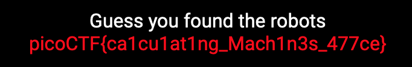

## asm1
### Category
Reverse Engineering
### Problem
What does asm1(0x6fa) return? Submit the flag as a hexadecimal value (starting with '0x'). NOTE: Your submission for this question will NOT be in the normal flag format. [Source](misc_files/test.S)
### Hints
1) assembly [conditions](https://www.tutorialspoint.com/assembly_programming/assembly_conditions.htm)
### Solution

**STEP 1**

Most websites have a ```robots.txt``` page, which can be accessed by appending ```robots.txt``` to the URL of the page that you are on. Make sure that there is a ```/``` immediately before ```robots.txt``` (but don't have two ```/```s before ```robots.txt```).

**STEP 2**

At the URL ```https://jupiter.challenges.picoctf.org/problem/36474/robots.txt```, we find the following text:

User-agent: *

Disallow: /477ce.html

*NB: The robots.txt file is a set of instructions for search engine crawlers telling them which pages they can or can't request from your site. It's used mainly for preventing a site from getting overloaded with requests.*

**STEP 3**

Now we can replace ```robots.txt``` with ```477ce.html``` in the foregoing URL. When we do so and load the URL ```https://jupiter.challenges.picoctf.org/problem/36474/477ce.html```, we get the following text:



Thus, we have the flag:

```picoCTF{ca1cu1at1ng_Mach1n3s_477ce}```
